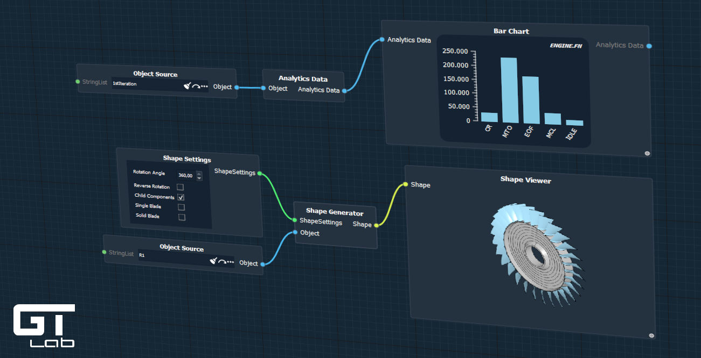

# GTlab-IntelliGraph

A [GTlab](https://github.com/dlr-gtlab) module to enable the creation of graph-based workflow. 




## Based on QtNodes

*IntelliGraph is based on [QtNodes by paceholder et al.](https://github.com/paceholder/nodeeditor) (version 2.2.2). QtNodes was adapted and extended in various ways to deeply integrated a graph-based workflow into the GTlab Framework.*

Following high-level features were added and changes were made:

- Added ability to group nodes.
- A dedicated graph execution model handles the correct execution of nodes and manages the transfer of data btween nodes:
  - Nodes are triggered only once all predecessors have been evaluated. 
  - The evaluation state of nodes is remembered
  - Manages the data a node requires and outputs
  - Nodes can be evaluated in a separate thread
- Each node can have its own painter and geometry object and thus be styled individually.
- Connections can be renderes in various shapes (Cubic, Rectangle and Straight).
- Nodes and their graphical representation are loosly coupled, allowing IntelliGraphs to be executed without a graphical user interface.
- Graphs are serialized using GTlab's Memento System instead of exporting the data to JSON.

## License

The largest portion of the code is licensed under the `BSD 3-Clause License`.

Smaller thirdparty party code part of code base uses other permissive licenses, such as the
`BSD` and `MIT` licenses. Please review the directory [LICENSES](https://github.com/dlr-gtlab/intelligraph-module/tree/main/LICENSES) and [.reuse](https://github.com/dlr-gtlab/intelligraph-module/tree/main/.reuse)
for a full overview on all licensed used.


## Compiling from Source

### Prerequisites

A working GTlab installation is required. This includes GTlab and the GTlab Logging library.
In addition, the Qt toolkit need to be installed to build the intelligraph module.


| Library              |  Version  | Bundled | Where to get                                 |
| -------------------- | --------- | ------- | -------------------------------------------- |
| Qt                   |  5.15.x   | No      | https://download.qt.io/official_releases/qt/ |
| GTlab Core + Logging |  >= 2.0   | No      | https://github.com/dlr-gtlab/gtlab-core      |

### Building

The intelligraph module requires a recent `CMake` (>3.15) to build. The configuration and build process is
similar to other CMake builds:

```
cmake -S . -B build_dir -DQt5_DIR=<path/to/cmake/Qt5> -DCMAKE_PREFIX_PATH=<path/to/gtlab_install> -DCMAKE_INSTALL_PREFIX=<path/to/gtlab_install>
cmake --build build_dir
cmake --build build_dir --target install
```
